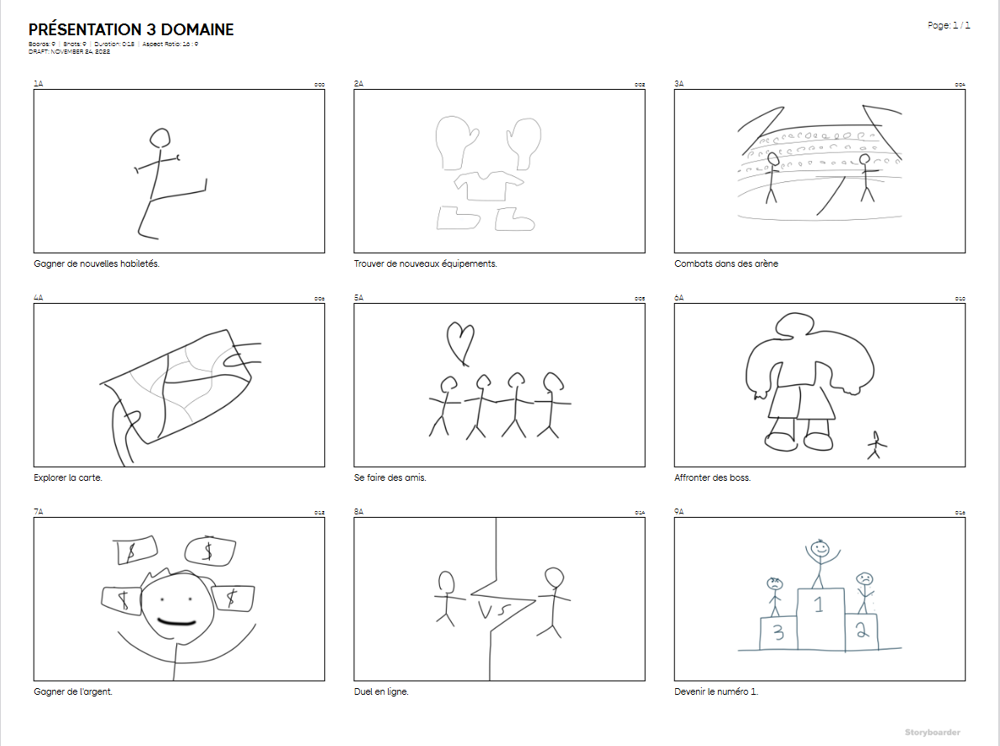
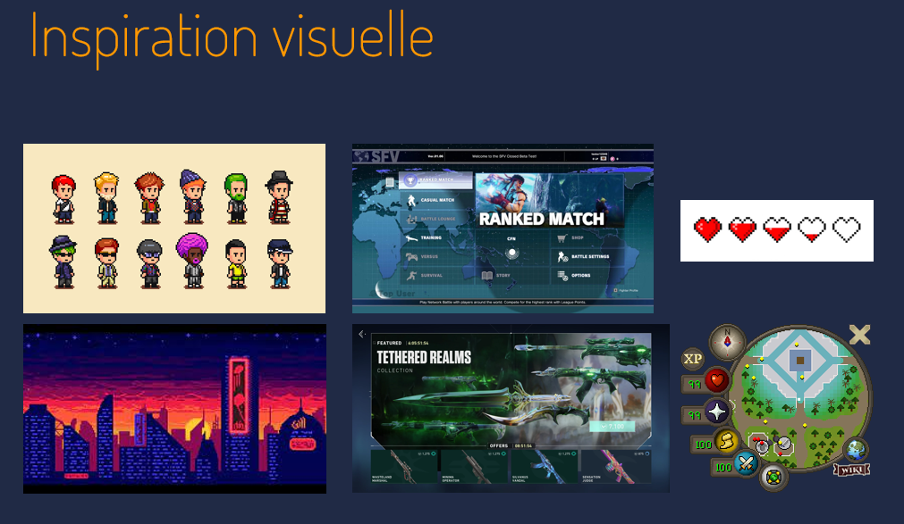

# Cours 14
## Plan de la présentation 3
Durée: 8 à 10 minutes

### Résumer votre projet en une phrase
Nous avons pensé à créer un jeu open world et multi-joueur dans un monde de style pixel !

### Description du projet 
Open world
Jeu de combat
Multi-joueur
Style
Monétisation
RPG

### Schéma du projet ou scénarimage

### Moodboard

### Technologies
Des ordinnateurs pour la programmation et le design. Micro pour enregistrement et différentes consoles pour jouer au jeu.

### Tâches
Programmation,
Animation 2D,
Textures,
Campagne marketing,
Création de la bande sonore,
Enregistrement des effets sonores,
Enregistrement des voix,
Écriture de l’histoire et
Design.

